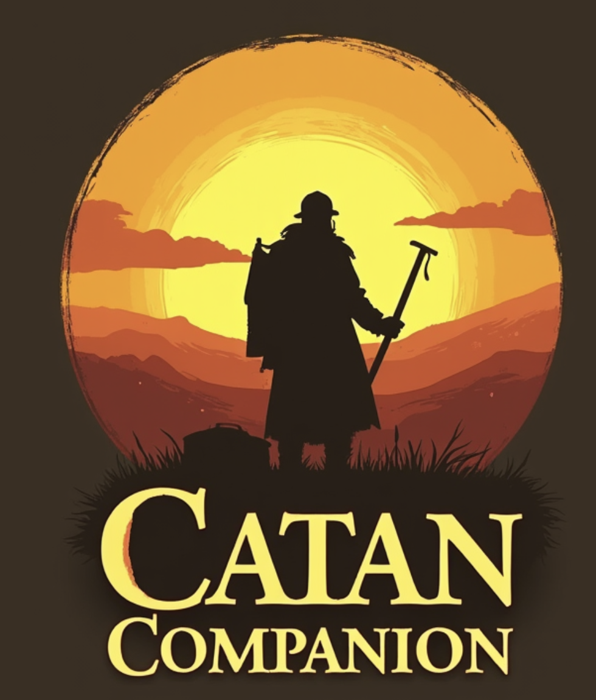

  <h1>Catan Companion</h1>
  
  
  

    A simple web application designed to enhance your in-person Catan gaming experience. 
    Generate balanced boards and track dice roll statistics during gameplay.
  

## Features

### 🎲 Board Generation
- Automatically generates balanced Catan boards
- Follows official Catan board layout rules
- Ensures 6s and 8s are never adjacent
- Includes proper resource distribution
- Supports shuffling for new layouts while maintaining game rules

### 📊 Roll Statistics Tracking
- Real-time dice roll tracking
- Visual statistics with percentage breakdowns
- Easy increment/decrement for corrections
- Tracks all possible roll combinations (2-12)
- Maintains roll history throughout the game

### 🎮 Game Management
- Start new games
- Continue existing games
- Generate new boards
- Shuffle existing layouts
- Responsive design for all devices

## Getting Started

1. Visit the application in your web browser
2. Click "Shuffle Board" to generate different layouts
3. Click "Start New Game" when ready to play
4. Use the roll tracker to record dice rolls during gameplay
5. Generate a new board anytime with "New Board"

## How to Use

### Board Generation
- Use the "Shuffle Board" button in setup to find a layout you like
- The board follows official Catan rules for resource and number distribution
- Red numbers (6 and 8) are automatically placed non-adjacent

### Roll Tracking
- Click `+` to record a dice roll
- Click `-` to correct mistakes
- View real-time statistics and percentages
- Track total rolls and distribution

## Development

Built with:
- React
- TypeScript
- Tailwind CSS
- Vite

## License

MIT License - feel free to use and modify for your own Catan games!